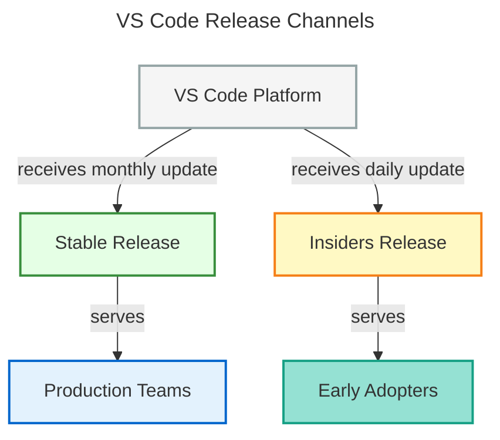
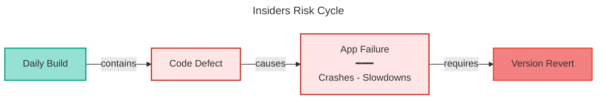
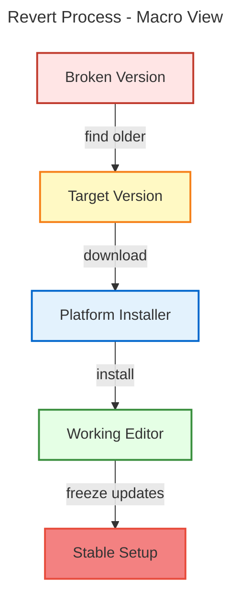
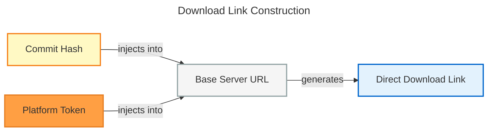
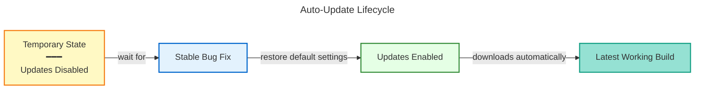

# VS Code Insiders - Reverting to a Previous Build

This guide will walk you through the process of reverting to an older version of Visual Studio Code Insiders if you encounter issues with the latest build. Whether you're experiencing crashes, broken extensions, or performance problems, this step-by-step guide will help you get back to a stable version while waiting for a fix.

## Background & Context

### What is Visual Studio Code?

Visual Studio Code ([VS Code](https://code.visualstudio.com)) is a code editor made by Microsoft. Think of it as a specialized notepad designed for programmers that helps you write and manage code across different programming languages.

### What is VS Code Insiders?

**[VS Code Insiders](https://code.visualstudio.com/insiders/)** is like the "early access" version of VS Code. Instead of waiting for polished, fully-tested releases, users of the `Insiders` build get new features and fixes **every single day**. This is exciting because you get cutting-edge features first - but it also means bugs sometimes slip through.

Think of VS Code Insiders like the [Chrome Canary browser](https://www.google.com/chrome/canary/) - it's where new code goes first, and while it's usually stable, it can occasionally break.



**Why have two versions?**

| Version          | Update Frequency       | Stability                      | Who Uses It                                             |
| ---------------- | ---------------------- | ------------------------------ | ------------------------------------------------------- |
| Regular VS Code  | Once a month (roughly) | Very stable; thoroughly tested | Most people; teams; production environments             |
| VS Code Insiders | Every day              | Sometimes has bugs             | Developers, testers, people who want new features first |

### Why do people use Insiders?

Users choose Insiders if they:

- Want access to new features before anyone else
- Are extension developers who want to test their work early
- Are debugging issues and need the latest code to test fixes

### Why does Insiders break sometimes?

Because updates come **every day**, developers occasionally release something that wasn't fully tested. This might:

- **Cause crashes** - The VS Code Insiders app won't open or keeps crashing when you try to use it
- **Break extensions** - Add-ons you rely on stop working or don't work with the new version
- **Slow things down** - The new version is noticeably laggy or feels sluggish
- **Introduce UI bugs** - Buttons don't work, menus act weird, or features disappear



**The good news?** A newer, fixed version will arrive tomorrow. But if you can't wait, you can **revert** - go back to an older version that was working.

### When should you revert?

Revert to an older build if you experience:

- **The app crashes** - VS Code Insiders won't start or crashes when you try to use it
- **Critical workflows are broken** - Debugging, extensions, or language features don't work
- **Recent extensions broke** - An update incompatible with your extensions, and no fix is available yet
- **Performance issues** - The new build is noticeably slower or has UI glitches

### Why is the revert process so complicated?

Typically when you have a problem with a software application, you can just download an older version from the website.

But VS Code Insiders doesn't list older versions on the main site for you to easily download. Instead, you have to access a hidden list of versions from the update servers, figure out which one you need, and then construct a special download link.

This guide walks you through that process step-by-step, so you can get back to a working version of VS Code Insiders as quickly as possible.

## How This Process Works (The Big Picture)

Reverting boils down to these core ideas:

1. **Find what's currently installed** - Get the version number of your broken build
2. **Find an older version that works** - Query the official VS Code Insiders servers for a list of recent older builds
3. **Pick which older version to use** - Choose one that's a day or two older than the broken one
4. **Get the right installer for your computer** - Different computers (Mac, Windows, Linux) need different installer files
5. **Download and install that older version** - Replace your broken build with the working older one
6. **Stop auto-updates temporarily** - Prevent VS Code Insiders from immediately updating back to the broken version



## Step-by-Step Instructions

### Step 1: Find Your Current (Broken) Version Number

**Why:** You need to know which version is broken so you can identify older versions to try.

**What to expect:** You're looking for a long string of letters and numbers (called a "commit hash"). It looks like: `1b91e5ec8aa7a39a2754f88e3be8177f5ea9c511`. Don't worry - you just need to copy it.

#### Method 1: Using the VS Code Menu (Easiest)

**If VS Code Insiders is open and working:**

1. Click the `Code - Insiders` menu at the very top-left (macOS) or click `Help` (Windows/Linux)
2. Look for `About Visual Studio Code - Insiders` (macOS) or `About` (Windows/Linux)
3. You'll see a window pop up with version information
4. **Find the line that says "Commit:"** followed by a long string of letters and numbers
5. **Copy this string** - triple-click to select all of it, then press `Cmd+C` (Mac) or `Ctrl+C` (Windows/Linux)

**Paste it into a text file or keep it handy** - you'll need it in the next step.

**✓ Success Check:** You've written down your commit hash. It should be a 40-character string of letters and numbers.

#### Method 2: Using the Terminal (For When VS Code Won't Open)

**If VS Code Insiders is crashing and won't open:**

1. Open your terminal:
   - **macOS**: Press `Cmd+Space`, type `terminal`, press Enter
   - **Windows**: Press `Windows key`, type `powershell`, press Enter
   - **Linux**: Open your terminal application (usually `Ctrl+Alt+T`)

2. Copy and paste this command, then press Enter:

```bash
code-insiders --version
```

If you get a "command not found" error, then follow the[steps here to add `code-insiders` to your PATH](https://code.visualstudio.com/docs/setup/mac#_launch-vs-code-from-the-command-line).

3. You'll see output that looks like:

```
1.117.5-insider
1b91e5ec8aa7a39a2754f88e3be8177f5ea9c511
arm64
```

4. The second line is your commit hash. **Copy it.**

**Paste it into a text file** - you'll need it next.

**✓ Success Check:** You have a 40-character string copied.

### Step 2: Get a List of Available Older Versions

**Why:** You need to see which previous versions are available for download. VS Code Insiders doesn't list them nicely on the website, but the official VS Code Insiders Update Servers have a list you can access.

**What to expect:** You'll see a list of commit hashes. Each one represents a version of VS Code Insiders released on a different day. You want to pick one that's **older than the broken version you found in Step 1**.

**Important:** You'll typically go back **1–3 days** (so pick a version that's 1–3 positions down in the list from the newest one).

#### Method 1: Using Your Web Browser (Recommended for beginners)

**This is the simplest method if you're not comfortable with the terminal.**

1. Open any web browser (Chrome, Safari, Firefox, Edge)
2. Go to this official URL of the VS Code Insiders Update Server:

```
https://update.code.visualstudio.com/api/commits/insider/
```

3. Your browser will display a **long block of data** (JSON - a structured list).

4. The data is organized with the **newest versions at the top**. You're looking for **commit IDs**, which are long strings of letters and numbers.

**Example of what you might see:**

```json
[
	"1b91e5ec8aa7a39a2754f88e3be8177f5ea9c511",
	"603ca23a7623678dea30c8f77d129d167af7622d",
	"8ae0d8eab63dbfe8e5bb1c0943d92d49f804869f",
	"f2b51f3f64f0a781a7633c2243cfdde589030e34"
]
```

5. **Find the commit hash that matches your broken version** (from Step 1). It will be near the start of the list e.g. `1b91e5ec8aa7a39a2754f88e3be8177f5ea9c511` in the example above.
6. **Pick a commit hash that is 1–3 positions before the current version** (so it's older than the broken one) e.g. `603ca23a7623678dea30c8f77d129d167af7622d` or `8ae0d8eab63dbfe8e5bb1c0943d92d49f804869f` in the example above.

**✓ Success Check:** You've copied a commit hash that's older than your broken version.

#### Method 2: Using Terminal (For Advanced Users)

**If you're comfortable with the terminal:**

```bash
# requires jq
curl -s https://update.code.visualstudio.com/api/commits/insider | jq -r '.[]'
```

This will print a clean list of commit hashes (newest first). Pick one that's 1–3 items down from your broken version.

### Step 3: Identify Your Platform

**Why:** VS Code works on three different operating systems (macOS, Windows, Linux), and each needs a different installer file. You need to tell the download server which one you want.

**What to expect:** You're just identifying your system type and finding the right "platform token" (a code name) to use.

| Image Section   | Download Option          | Platform Token         |
| --------------- | ------------------------ | ---------------------- |
| Windows         | User Installer (x64)     | win32-x64-user         |
|                 | User Installer (Arm64)   | win32-arm64-user       |
|                 | System Installer (x64)   | win32-x64              |
|                 | System Installer (Arm64) | win32-arm64            |
|                 | .zip (x64)               | win32-x64-archive      |
|                 | .zip (Arm64)             | win32-arm64-archive    |
| Linux (.deb)    | x64                      | linux-deb-x64          |
|                 | Arm32                    | linux-deb-armhf        |
|                 | Arm64                    | linux-deb-arm64        |
| Linux (.rpm)    | x64                      | linux-rpm-x64          |
|                 | Arm32                    | linux-rpm-armhf        |
|                 | Arm64                    | linux-rpm-arm64        |
| Linux (.tar.gz) | x64                      | linux-x64              |
|                 | Arm32                    | linux-armhf            |
|                 | Arm64                    | linux-arm64            |
| Mac             | Universal                | darwin-universal       |
|                 | Apple Silicon            | darwin-arm64           |
|                 | Intel Chip               | darwin (or darwin-x64) |

**Copy your platform token and keep it handy.**

**✓ Success Check:** You've identified your platform token (it should be one of the codes above).

### Step 4: Build Your Download Link

**Why:** Now you have all the pieces (which version + which platform), and you're combining them into a download link.

**What to expect:** You're creating a URL (web address) that points directly to the installer file you need.



**The formula:**

```
https://update.code.visualstudio.com/commit:{YOUR_COMMIT_HASH}/{YOUR_PLATFORM_TOKEN}/insider
```

**Step by step:**

1. **Replace `{YOUR_COMMIT_HASH}`** with the commit hash from Step 3
2. **Replace `{YOUR_PLATFORM_TOKEN}`** with the platform token from Step 4
3. **Keep everything else exactly the same**

**Worked Example (macOS user):**

- Commit hash from Step 3: `8ae0d8eab63dbfe8e5bb1c0943d92d49f804869f`
- Platform token from Step 4: `darwin-arm64`

Your final URL:

```
https://update.code.visualstudio.com/commit:8ae0d8eab63dbfe8e5bb1c0943d92d49f804869f/darwin-arm64/insider
```

**⚠️ Important:** Make sure you copy the commit hash and platform token **exactly** - typos will cause the download to fail.

**✓ Success Check:** You have a complete URL that looks similar to the example above (but with your specific hash and platform).

### Step 5: Download the Installer

**Why:** Now you're actually getting the file you need.

**What to expect:** Your browser will download a large file (usually 100–300 MB). It might take a few minutes.
**Option A: Using Your Browser (Easiest)**

1. **Copy your URL from Step 4**
2. Open a new browser tab
3. Paste the URL into the address bar and press Enter
4. The file should start downloading automatically.

**✓ Success Check:** You have the installer file downloaded to your computer.
**Option B: Using the Terminal (Advanced)**

If you prefer the command line:

```bash
# follow redirects, fail on HTTP errors, and save to a file (add extension if needed)
curl -fL -o "vscode-insiders-installer" "https://update.code.visualstudio.com/commit:YOUR_COMMIT_HASH/YOUR_PLATFORM_TOKEN/insider"
```

Replace `YOUR_COMMIT_HASH` and `YOUR_PLATFORM_TOKEN` with your actual values from Steps 3 and 4.

The file will download to your current directory (usually your home folder or Downloads, depending on your setup).

### Step 6: Install the Downloaded Version

**Why:** Now you're replacing your broken Insiders build with the older, working version you just downloaded.

**What to expect:** You're running an installer (similar to installing any other software), which will replace the broken version with the working one.

⚠️ **Warning:** This will replace your current Insiders build. Your local settings and installed extensions should remain on the same machine; [Settings Sync](https://code.visualstudio.com/docs/configure/settings-sync) is only needed if you want the same setup mirrored across devices.

The installation process varies by platform, but it's generally straightforward. Just follow the usual installation steps for your operating system. And then open VS Code Insiders to verify it worked.
Once you open it, check the commit hash again to confirm if it's the same you had copied from Step 3.

✓ **Success Check:** VS Code opens without crashing, and the commit hash matches what you installed.

### Step 7: Temporarily Disable Auto-Updates

**Why:** If you skip this step, VS Code will automatically update back to the broken version the very next day. This temporarily pauses updates so you can use the working version until a real fix is released.

**What to expect:** You're changing one simple setting to pause automatic updates.



**Note:** This page on VS Code documentation provides more details: [Update Mode](https://code.visualstudio.com/docs/enterprise/updates). Even though the documentation is for Enterprise Deployments, the setting is the same for all users.

⚠️ **Important:** This is **temporary**. You'll turn auto-updates back on once a fix is released (usually within 1–3 days).

#### Method 1: Using the Settings Menu (Easiest)

1. **Open VS Code Insiders** (the version you just installed)
2. **Go to Preferences:**
   - **macOS**: Click `Code` > `Preferences` > `Settings`
   - **Windows/Linux**: Click `File` > `Preferences` > `Settings`
3. **Or use keyboard shortcut:** `Cmd+,` (macOS) or `Ctrl+,` (Windows/Linux)

4. **In the search box at the top, type:** `Update: Mode`

5. **You'll see a dropdown menu that currently says `default`**

6. **Click the dropdown and change it to `none`** (this means updates won't happen automatically)

7. **The change is saved automatically** - you're done!

✓ **Success Check:** The setting now shows `none`.

#### Method 2: Direct File Edit (Alternative)

If you prefer editing the settings file directly:

1. **Open VS Code**
2. **Go to: Code > Preferences > Settings** (or `Cmd+,`)
3. **Click the "Open Settings (JSON)" icon** - it looks like `{ }` in the top-right corner
4. **Find or add this line:**

```json
"update.mode": "none"
```

5. **Save the file** (`Cmd+S` or `Ctrl+S`)

### Step 8: Turn Auto-Updates Back On (When Fixed)

**When should you do this?**

Once a new version of Insiders is released that **doesn't crash**, turn auto-updates back on. This is usually within 1–3 days.

**How to turn it back on:**

1. **Go back to Settings** (same as above)
2. **Search for `Update: Mode`**
3. **Change it from `none` back to `default`**
4. **Restart VS Code** - it will automatically check for and install the latest version

## Troubleshooting & Common Problems

### Problem: "404 Not Found" when trying to download

**This means the URL is wrong or the version doesn't exist for your platform.**

**Solutions (in order):**

1. **Double-check your commit hash** - did you copy it exactly from Step 3? Any typos?
2. **Double-check your platform token** - is it spelled correctly from Step 4?
3. **Try a different commit from the list** - go back to Step 2 and pick the next commit down
4. **Verify the full URL** - copy it into a text editor and read through it character by character for typos

### Problem: VS Code still crashes after installing the older version

**This means the version you picked still had the bug.**

**Solutions:**

1. **Try an even older version:**
   - Go back to Step 2 and get a fresh list of versions
   - Pick a commit that's **3–4 positions older** (instead of 1–2)
   - Repeat Steps 3–7 with the new version

2. **If multiple older versions also crash:**
   - This suggests the bug might be deeper in the code
   - Try reverting even further (5+ days old)
   - If that still doesn't work, report the issue to the VS Code team

### Problem: I installed the older version but extensions don't work

**Extensions sometimes need to be updated to work with older VS Code versions.**

**Solutions:**

1. **Wait a day or two** for extension authors to release compatible versions
2. **Disable the extension temporarily:**
   - Go to the Extensions panel (usually on the left sidebar)
   - Find the broken extension
   - Click the three dots > "Disable"
3. **Disable all extensions and re-enable them one by one:**
   - This helps identify which one is causing the problem
   - Go to `Code > Preferences > Extensions` and disable all
   - Then re-enable them one at a time to find the culprit

### Problem: I want to go back to the latest version now

**Maybe the bug was fixed, or you just want to try the newest version again.**

**Steps:**

1. **Go to Settings** - `Code > Preferences > Settings` (or `Cmd+,` / `Ctrl+,`)
2. **Search for `Update: Mode`**
3. **Change it from `manual` back to `default`**
4. **Restart VS Code**
5. **VS Code will check for the latest version and install it automatically** (this might take a minute)
